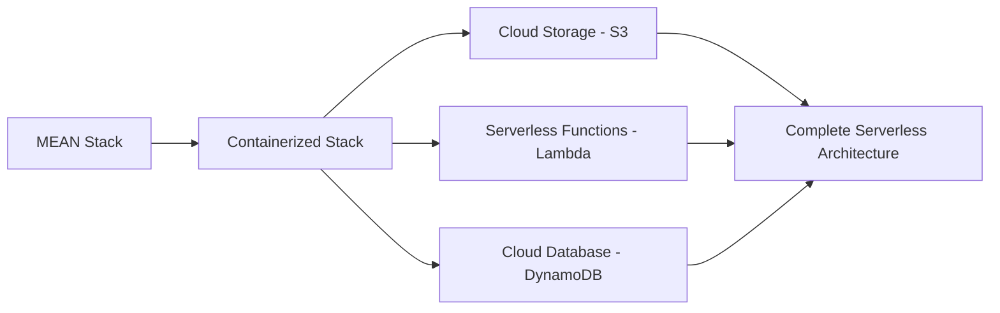

# CS470: Full Stack Development II

## Course Overview

This repository documents my journey through CS470 Full Stack Development II, where I transformed a traditional MEAN stack application into a cloud-native serverless architecture on AWS.

### 🚀 Key Technologies

| Frontend | Backend | Database | Cloud Services | DevOps |
|:--------:|:-------:|:--------:|:-------------:|:------:|
| Angular  | Node.js | DynamoDB | AWS Lambda    | Docker |
|          | Express | MongoDB  | API Gateway   | Docker Compose |
|          |         |          | S3            | IAM    |

## 🏗️ Architecture Evolution

The project evolved through several architectural stages:

1. **Containerization** - Dockerizing the MEAN stack application
2. **Container Orchestration** - Implementing Docker Compose
3. **Cloud Migration** - Deploying to AWS S3, Lambda, and DynamoDB
4. **Serverless Architecture** - Eliminating server management with Lambda functions

## 📋 Repository Contents

- `Final_Reflection.pdf` - Comprehensive reflection on learning outcomes and cloud architecture planning
- [Project Presentation Video](https://snhu-my.sharepoint.com/:v:/g/personal/mehdi_mihir_snhu_edu/EcG0c0fFObJHluYVctdRxYgBuiohiVWkwR5M0Gw90hZnmg) - Detailed walkthrough of the architecture and implementation (SNHU access only)

## 🔄 Migration Process

## 🌐 Key Learning Outcomes

- Designing serverless architectures for scalability and cost efficiency
- Implementing secure cloud applications with proper IAM configurations
- Migrating from traditional databases to cloud-native solutions
- Creating API Gateways for secure, scalable API access
- Planning for growth with elasticity and pay-for-service models

## 💡 Serverless Benefits Demonstrated

- **Scalability** - Automatic scaling based on demand
- **Cost Efficiency** - Pay only for resources used
- **Reduced Management** - No server provisioning or maintenance
- **Security** - Fine-grained access control through IAM

## 🔐 Security Implementation

Implemented the principle of least privilege through:
- Custom IAM roles and policies
- Secure API Gateway configurations
- Encrypted communications between services

## 📊 Performance Considerations

- Cold start management for Lambda functions
- Cross-origin resource sharing (CORS) configuration
- DynamoDB capacity planning and optimization

## 📝 Final Reflection Highlights

The `CS-470 - 8-1 - Final Reflection.pdf` document includes:
- Analysis of cloud-based development principles
- Comparison of containerization vs. serverless approaches
- Strategies for handling scale and error management
- Cost prediction models for different architectural approaches
- Planning for future growth using microservices architecture

## 🏆 Skills Developed

- Cloud Solutions Architecture
- Serverless Application Development
- DevOps Engineering
- Full Stack Development
- Cloud Security Implementation

---

Developed as part of SNHU's Computer Science program

© Mehdi, 2025

